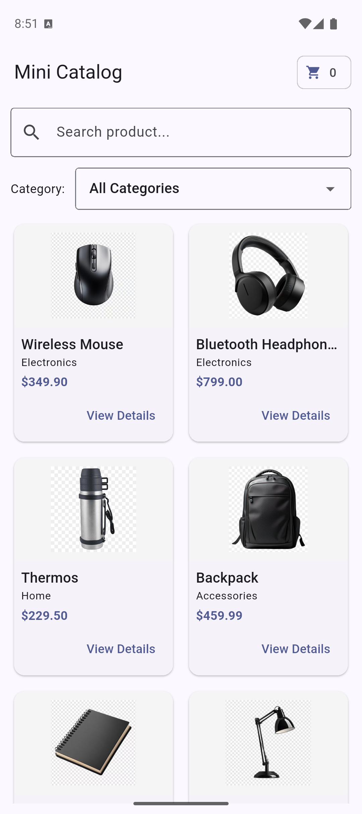
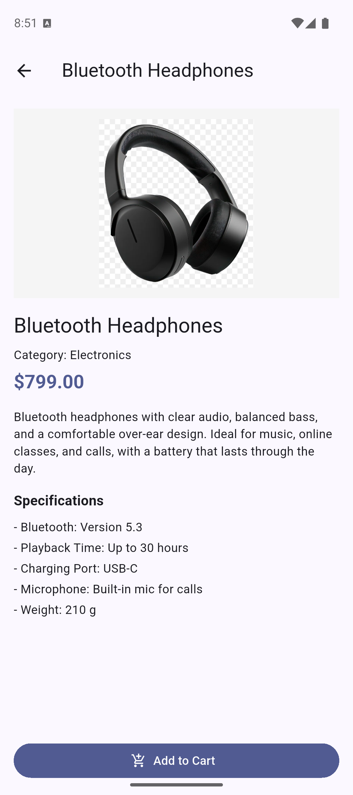
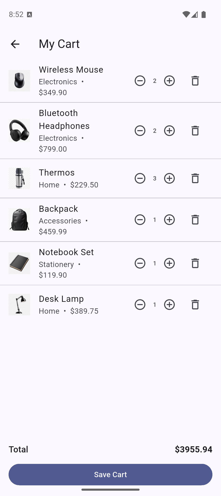

# Mini Catalog App

Mini Catalog is a beginner-friendly Flutter project created for training purposes.
It demonstrates the core mobile app flow with product listing, detail navigation,
cart simulation, and basic state management.

## Project Purpose

This project helps learners practice:

- Flutter widget structure (`StatelessWidget` / `StatefulWidget`)
- Screen navigation with `Navigator`
- Model usage with `fromJson` / `toJson`
- Grid/list rendering (`GridView.builder`, `ListView`)
- Basic cart state updates (add, increase, decrease, remove)
- Simple UI composition without third-party packages

## Features

- Product listing on home screen
- Search and category filtering
- Product detail page
- Add to cart action
- Cart page with:
  - quantity controls (`+` / `-`)
  - remove item button
  - total price calculation
- Asset image support with fallback icon

## Screenshots

Add your screenshots to `assets/screenshots/` with the filenames below.

<p align="center">
  
  
  
</p>

## Tech Stack

- Flutter SDK
- Dart SDK
- Material Design (`material.dart`)
- No extra package dependency for app features

## Folder Highlights

```text
lib/
  main.dart          # App UI, model, pages, and cart logic
assets/
  images/            # Product images
```

## Getting Started

### 1) Requirements

- Flutter installed and configured
- Android Studio or VS Code
- Android Emulator or physical Android device

Check installation:

```bash
flutter doctor
```

### 2) Install dependencies

```bash
flutter pub get
```

### 3) Run the app

```bash
flutter run
```

If multiple devices are connected:

```bash
flutter devices
flutter run -d <device_id>
```

## Assets

Make sure these files exist in `assets/images/`:

- `mouse.png`
- `headphone.png`
- `thermos.png`
- `bag.png`
- `notebook.png`
- `lamp.png`

Asset path is already configured in `pubspec.yaml`.

## Notes

- Prices are displayed in USD format (`$`).
- Cart behavior is simulated locally (no backend/payment integration).
- This repository is intentionally kept simple for educational use.
